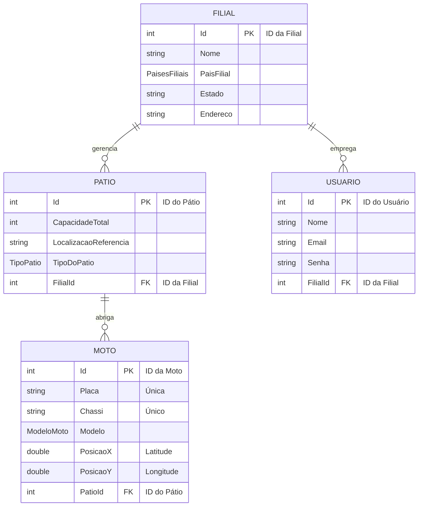

<div align="center">
  
  <h1 align="center">GeoMottu API</h1>
  <p align="center">
    <strong>API de Gerenciamento de Frotas e Geolocalização para a Mottu</strong>
  </p>
  <p align="center">
    Uma solução completa para o gerenciamento de filiais, pátios e motos, construída com .NET 8 e Clean Architecture.
  </p>
  
  
  
  
  
  

</div>

---
## ✍️ Autores

<div align="center">

| Nome | RM |
| :--- | :--- |
| **Wesley Sena dos Santos** | 558043 |
| **Vanessa Yukari Iwamoto** | 555130 |
| **Samara Victoria Ferraz dos Santos** | 558092 |

</div>

---

## 🧭 Índice

1.  [**🎯 Sobre o Projeto**](#-sobre-o-projeto)
2.  [**✨ Funcionalidades Principais**](#-funcionalidades-principais)
3.  [**🏗️ Filosofia de Arquitetura**](#️-filosofia-de-arquitetura)
    -   [Decisões de Arquitetura](#-decisões-de-arquitetura)
4.  [**🛠️ Tech Stack**](#️-tech-stack)
5.  [**🗃️ Modelo de Dados**](#️-modelo-de-dados)
6.  [**🐳 Docker**](#-docker)
7.  [**🚀 Como Executar**](#-como-executar)
8. [**📖 Guia da API**](#-guia-da-api)


---

## 🎯 Sobre o Projeto

> Esta API foi desenvolvida como uma solução robusta e escalável para o gerenciamento de frotas da **Mottu**. O sistema centraliza o controle de **Motos**, **Pátios** de estacionamento e **Filiais**, resolvendo o desafio de administrar uma frota distribuída geograficamente. Através de uma interface RESTful bem definida, a plataforma permite que sistemas clientes (aplicativos móveis, dashboards web, etc.) realizem operações críticas como cadastrar novas motos, alocá-las em pátios específicos e administrar a capacidade logística de cada filial em tempo real.

---

## ✨ Funcionalidades Principais

-   ✔️ **Gestão de Entidades Core**: CRUD completo para Filiais, Pátios, Motos e Usuários.
-   ✔️ **Buscas Avançadas**: Consultas de motos por placa ou chassi únicos, garantindo a integridade dos dados.
-   ✔️ **Controle de Capacidade**: Lógica de negócio que impede a alocação de uma moto em um pátio que já atingiu sua capacidade máxima.
-   ✔️ **Paginação Eficiente**: Todas as rotas de listagem (`GET`) incluem paginação com `offSet` e `take` para otimizar a transferência de dados e a performance do cliente.
-   ✔️ **API Autodescoberta com HATEOAS**: As respostas das coleções incluem links para ações relacionadas (self, create, update, delete), permitindo que os clientes naveguem pela API de forma dinâmica.
-   ✔️ **Documentação OpenAPI (Swagger)**: A API é 100% autodocumentada e interativa, com exemplos claros de requisições e respostas para cada endpoint.
-   ✔️ **Mecanismos de Defesa**:
    -   **Rate Limiting**: Proteção contra abuso e ataques de força bruta, limitando as requisições a 20 por minuto por cliente.
-   ✔️ **Otimização de Performance**:
    -   **Compressão de Resposta (Brotli/Gzip)**: Reduz drasticamente o tamanho dos payloads JSON, economizando banda e acelerando o tempo de resposta em redes lentas.

---

## 🏗️ Filosofia de Arquitetura

O projeto foi estruturado seguindo os princípios da **Clean Architecture**, visando a separação de responsabilidades, alta coesão, baixo acoplamento e testabilidade.

O fluxo de uma requisição segue um caminho claro através das camadas:

`Presentation` ➡️ `Application` ➡️ `Domain` ⬅️ `Infrastructure`

1.  **Presentation (Controllers)**: Recebe a requisição HTTP, valida os dados de entrada e invoca o caso de uso apropriado.
2.  **Application (UseCases)**: Orquestra a execução da regra de negócio. Ele não contém lógica de negócio em si, mas coordena os repositórios e entidades para realizar uma operação.
3.  **Domain (Entities & Interfaces)**: O coração da aplicação. Contém as entidades de negócio e as abstrações (interfaces) para a persistência de dados. Esta camada não depende de nenhuma outra.
4.  **Infrastructure (Repositories & DbContext)**: Implementa as interfaces de repositório definidas no Domain, utilizando o Entity Framework Core para se comunicar com o banco de dados Oracle.

### 🧠 Decisões de Arquitetura

-   **Wrapper `OperationResult<T>`**: Todas as respostas dos UseCases são encapsuladas em um objeto `OperationResult`. Isso padroniza o tratamento de sucesso e erro em toda a API, retornando um status code HTTP consistente e mensagens de erro claras, simplificando a lógica no cliente.
-   **Injeção de Dependência Nativa**: O projeto utiliza extensivamente o sistema de injeção de dependência do ASP.NET Core para gerenciar o ciclo de vida dos serviços, repositórios e do DbContext, promovendo um código desacoplado e fácil de testar.
-   **Migrations Automáticas na Inicialização**: Para simplificar o deploy em ambientes de desenvolvimento e teste, a aplicação aplica automaticamente as migrations pendentes do EF Core ao iniciar. *Em um ambiente de produção complexo, essa estratégia seria substituída por um passo explícito no pipeline de CI/CD.*
-   **Mapeamento de Enums para String**: No `DbContext`, os enums (`ModeloMoto`, `TipoPatio`) são persistidos como strings no banco de dados. Isso aumenta a legibilidade dos dados diretamente no banco, facilitando a depuração e a criação de relatórios.

---

## 🛠️ Tech Stack

-   🌐 **Framework**: .NET 8
-   🗄️ **ORM**: Entity Framework Core 8
-   🐘 **Banco de Dados**: Oracle
-   📖 **Documentação**: Swashbuckle.AspNetCore 6.6.2 (Swagger)
-   📦 **Gerenciador de Pacotes**: NuGet
-   🐳 **Containerização**: Docker

---

## 🗃️ Modelo de Dados

As entidades são relacionadas para espelhar a estrutura operacional da Mottu. A relação principal é que uma `Filial` gerencia múltiplos `Pátios`, e cada `Pátio` abriga múltiplas `Motos`.



---

## 🐳 Docker

Para facilitar a portabilidade e garantir um ambiente de execução consistente, o projeto está pronto para ser containerizado. Abaixo um `Dockerfile` de exemplo que utiliza **multi-stage builds** para criar uma imagem otimizada e segura para produção.

```Dockerfile
# Estágio 1: Build da aplicação
FROM [mcr.microsoft.com/dotnet/sdk:8.0](https://mcr.microsoft.com/dotnet/sdk:8.0) AS build
WORKDIR /src

# Copia os arquivos de projeto e restaura as dependências
COPY ["GeoMottuMinimalApi/GeoMottuMinimalApi.csproj", "GeoMottuMinimalApi/"]
COPY ["GeoMottuMinimalApi.sln", "."]
RUN dotnet restore "GeoMottuMinimalApi.sln"

# Copia o restante do código e publica a aplicação
COPY . .
WORKDIR "/src/GeoMottuMinimalApi"
RUN dotnet publish "GeoMottuMinimalApi.csproj" -c Release -o /app/publish

# Estágio 2: Imagem final de produção
FROM [mcr.microsoft.com/dotnet/aspnet:8.0](https://mcr.microsoft.com/dotnet/aspnet:8.0) AS final
WORKDIR /app
COPY --from=build /app/publish .

# Expõe a porta que a aplicação vai usar
EXPOSE 8080

# Define a variável de ambiente para a porta (importante para Render/Azure)
ENV ASPNETCORE_URLS=http://+:8080

# Ponto de entrada para executar a aplicação
ENTRYPOINT ["dotnet", "GeoMottuMinimalApi.dll"]
```

---

## 🚀 Como Executar

Siga os passos abaixo para configurar e executar o ambiente de desenvolvimento local.

### 1. Pré-requisitos

-   Instalação do **[.NET 8 SDK](https://dotnet.microsoft.com/download/dotnet/8.0)**.
-   Acesso a uma instância de banco de dados **Oracle**.
-   **(Opcional)** [Docker Desktop](https://www.docker.com/products/docker-desktop/) para execução em container.

### 2. Clonar o Repositório

```bash
git clone <URL_DO_SEU_REPOSITORIO>
cd GeoMottuMinimalApi
```

### 3. Configurar a Conexão com o Banco

Edite o arquivo `GeoMottuMinimalApi/appsettings.Development.json` e insira as credenciais do seu banco de dados Oracle na `ConnectionString`:

```json
{
  "ConnectionStrings": {
    "Oracle": "Data Source=...;User Id=<SEU_USUARIO>;Password=<SUA_SENHA>;"
  }
}
```

### 4. Instalar Dependências e Executar

O projeto já está pronto. Abra um terminal na pasta raiz (onde está o `.sln`) e execute:

```bash
# Restaura os pacotes NuGet
dotnet restore

# Inicia a aplicação
dotnet run --project GeoMottuMinimalApi
```

### 5. Acessar a API

-   **URL Base da API**: `http://localhost:5279`
-   **Documentação Swagger**: `http://localhost:5279/swagger`

---

## 📖 Guia da API

A documentação interativa no Swagger é a fonte da verdade para todos os endpoints.

### Endpoints de `Filial`
| Método | Rota             | Descrição                 |
| :----- | :--------------- | :------------------------ |
| `GET`  | `/api/filial`    | Lista filiais (paginado).   |
| `GET`  | `/api/filial/{id}`| Busca uma filial por ID.    |
| `POST` | `/api/filial`    | Cria uma nova filial.       |
| `PUT`  | `/api/filial/{id}`| Atualiza uma filial.        |
| `DELETE`|`/api/filial/{id}`| Deleta uma filial.          |

### Endpoints de `Patio`
| Método | Rota            | Descrição                |
| :----- | :-------------- | :----------------------- |
| `GET`  | `/api/patio`    | Lista pátios (paginado).   |
| `GET`  | `/api/patio/{id}`| Busca um pátio por ID.     |
| `POST` | `/api/patio`    | Cria um novo pátio.        |
| `PUT`  | `/api/patio/{id}`| Atualiza um pátio.         |
| `DELETE`|`/api/patio/{id}`| Deleta um pátio.           |

### Endpoints de `Moto`
| Método | Rota                      | Descrição                  |
| :----- | :------------------------ | :------------------------- |
| `GET`  | `/api/moto`               | Lista motos (paginado).      |
| `GET`  | `/api/moto/{id}`          | Busca uma moto por ID.       |
| `GET`  | `/api/moto/placa/{placa}` | Busca uma moto pela placa.   |
| `GET`  | `/api/moto/chassi/{chassi}`| Busca uma moto pelo chassi.  |
| `GET`  | `/api/moto/modelo/{modelo}`| Busca uma moto pelo modelo(paginado).  |
| `POST` | `/api/moto`               | Cria uma nova moto.          |
| `PUT`  | `/api/moto/{id}`          | Atualiza uma moto.           |
| `DELETE`|`/api/moto/{id}`          | Deleta uma moto.             |

### Endpoints de `Usuario`
| Método | Rota                   | Descrição                    |
| :----- | :--------------------- | :--------------------------- |
| `GET`  | `/api/usuario`         | Lista usuários (paginado).     |
| `GET`  | `/api/usuario/{id}`    | Busca um usuário por ID.       |
| `GET`  | `/api/usuario/email/{email}`| Busca um usuário por e-mail. |
| `POST` | `/api/usuario`         | Cria um novo usuário.          |
| `PUT`  | `/api/usuario/{id}`    | Atualiza um usuário.           |
| `DELETE`|`/api/usuario/{id}`    | Deleta um usuário.             |

---
