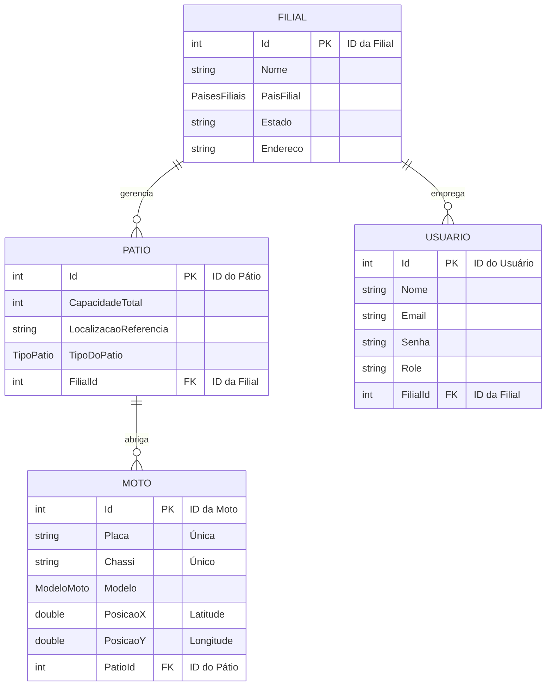

<div align="center">
  <h1 align="center">GeoMottu API</h1>
  <p align="center">
    <strong>API de Gerenciamento de Frotas e Geolocalização para a Mottu</strong>
  </p>
  <p align="center">
    Uma solução completa para o gerenciamento de filiais, pátios e motos, construída com .NET 8 e Clean Architecture.
  </p>
  
  
  
  
  
  

</div>

---
## ✍️ Autores

<div align="center">

| Nome | RM |
| :--- | :--- |
| **Wesley Sena dos Santos** | 558043 |
| **Vanessa Yukari Iwamoto** | 555130 |
| **Samara Victoria Ferraz dos Santos** | 558092 |

</div>

---

## **🧭 Índice**

1. [**🎯 Sobre o Projeto**](https://www.google.com/search?q=%23-sobre-o-projeto)  
2. [**✨ Funcionalidades Principais**](https://www.google.com/search?q=%23-funcionalidades-principais)  
3. [**🤖 Funcionalidade de Machine Learning (ML.NET)**](https://www.google.com/search?q=%23-funcionalidade-de-machine-learning-mlnet)  
4. [**🏗️ Filosofia de Arquitetura**](https://www.google.com/search?q=%23%EF%B8%8F-filosofia-de-arquitetura)  
   * [Estrutura da Solução](https://www.google.com/search?q=%23estrutura-da-solu%C3%A7%C3%A3o)  
   * [Decisões de Arquitetura](https://www.google.com/search?q=%23-decis%C3%B5es-de-arquitetura)  
5. [**🛠️ Tech Stack**](https://www.google.com/search?q=%23%EF%B8%8F-tech-stack)  
6. [**🗃️ Modelo de Dados**](https://www.google.com/search?q=%23%EF%B8%8F-modelo-de-dados)  
7. [**🚀 Como Executar (Localmente)**](https://www.google.com/search?q=%23-como-executar-localmente)  
   * [Script de População de Dados (Obrigatório para ML)](https://www.google.com/search?q=%23-script-de-popula%C3%A7%C3%A3o-de-dados-obrigat%C3%B3rio-para-ml)  
8. [**🧪 Como Rodar os Testes**](https://www.google.com/search?q=%23-como-rodar-os-testes)  
9. [**📖 Guia da API (Endpoints)**](https://www.google.com/search?q=%23-guia-da-api-endpoints)  
10. [**🔗 Deploy (Render)**](https://www.google.com/search?q=%23-deploy-render)

## **🎯 Sobre o Projeto**

Esta API foi desenvolvida como uma solução robusta e escalável para o gerenciamento de frotas da **Mottu**. O sistema centraliza o controle de **Motos**, **Pátios** de estacionamento e **Filiais**, resolvendo o desafio de administrar uma frota distribuída geograficamente. Através de uma interface RESTful bem definida, a plataforma permite que sistemas clientes (aplicativos móveis, dashboards web, etc.) realizem operações críticas como cadastrar novas motos, alocá-las em pátios específicos e administrar a capacidade logística de cada filial em tempo real.

O grande diferencial é a inclusão de um módulo de **Inteligência Artificial (ML.NET)** para analisar a geolocalização de toda a frota e agrupá-la (clusterizar) automaticamente, permitindo uma tomada de decisão logística mais inteligente.

## **✨ Funcionalidades Principais**

* ✔️ **Gestão de Entidades Core**: CRUD completo para Filiais, Pátios, Motos e Usuários.  
* ✔️ **Autenticação e Autorização**: Sistema seguro baseado em **JWT** com autorização granular baseada em **Roles** (USER / ADMIN).  
* ✔️ **Machine Learning (ML.NET)**: Treinamento e predição de clusterização geoespacial (K-Means) para a frota de motos.  
* ✔️ **Lógica de Negócio Complexa**: Validação em tempo real que impede a alocação de uma moto em um pátio que já atingiu sua capacidade máxima (na criação e atualização).  
* ✔️ **Buscas Avançadas**: Consultas de motos por placa ou chassi únicos (case-insensitive).  
* ✔️ **Paginação Eficiente**: Todas as rotas de listagem (GET) incluem paginação com offSet e take para otimizar a performance.  
* ✔️ **API Autodescoberta (HATEOAS)**: As respostas das coleções incluem links para ações relacionadas (self, create, update, delete), permitindo que os clientes naveguem pela API de forma dinâmica.  
* ✔️ **Documentação OpenAPI (Swagger)**: A API é 100% autodocumentada e interativa, com exemplos claros de Request e Response para cada endpoint.  
* ✔️ **Cobertura de Testes Completa**: Mais de **60 testes unitários e de integração** cobrindo todas as camadas da arquitetura.  
* ✔️ **Mecanismos de Defesa**:  
  * **Rate Limiting**: Proteção contra abuso, limitando as requisições a 20 por minuto.  
* ✔️ **Otimização de Performance**:  
  * **Compressão de Resposta (Brotli/Gzip)**: Reduz o tamanho dos payloads JSON, acelerando o tempo de resposta.  
* ✔️ **Monitoramento de Saúde**: Endpoints \[AllowAnonymous\] de *Health Check* (/api/Health/live e /api/Health/ready) que verificam a saúde da API e do banco de dados Oracle.

## **🤖 Funcionalidade de Machine Learning (ML.NET)**

O ClusterizacaoMotosController expõe a funcionalidade de IA do projeto, permitindo análises geoespaciais sobre a frota.

### **1\. Treinamento do Modelo**

Este endpoint é responsável por criar o modelo de clusterização.

* **Endpoint:** GET /api/ClusterizacaoMotos/Treinar  
* **Autorização:** ADMIN  
* **O que faz:**  
  1. Busca a geolocalização (PosicaoX, PosicaoY) de **todas** as motos no banco de dados. (É por isso que a execução do popula\_banco.sql é crucial).  
  2. Usa o algoritmo **K-Means** do ML.NET para encontrar 4 "clusters" (agrupamentos) geográficos.  
  3. Salva o modelo treinado no servidor, no arquivo Treinamento/ModeloClusterMotos.zip.

### **2\. Predição de Cluster**

Este endpoint usa o modelo treinado para classificar uma nova coordenada.

* **Endpoint:** GET /api/ClusterizacaoMotos/PreverCluster  
* **Autorização:** USER, ADMIN  
* **Parâmetros (Query):**  
  * posX (ex: \-46.63)  
  * posY (ex: \-23.55)  
* **O que faz:**  
  1. Carrega o arquivo ModeloClusterMotos.zip (se ele não existir, retorna um erro 400 \- "treine o modelo primeiro").  
  2. Prevê a qual cluster (ID de 0 a 3\) a nova coordenada pertence.  
* **Resposta (Exemplo):**  
  ```
  {  
    "data": {  
      "localizacaoEntrada": {  
        "posicaoX": \-46.63,  
        "posicaoY": \-23.55  
      },  
      "clusterPrevisto": 2,  
      "distancias": \[ 150.2, 80.5, 5.2, 210.9 \]  
    }  
  }
  ```

## **🏗️ Filosofia de Arquitetura**

O projeto foi estruturado seguindo os princípios da **Clean Architecture**, visando a separação de responsabilidades, alta coesão, baixo acoplamento e testabilidade.

O fluxo de uma requisição segue um caminho claro através das camadas:

Presentation ➡️ Application ➡️ Domain ⬅️ Infrastructure

1. **Presentation (API / Controllers)**: Recebe a requisição HTTP, valida os DTOs e invoca o caso de uso apropriado. É a única camada que conhece o "mundo exterior".  
2. **Application (UseCases)**: Orquestra a execução da regra de negócio. Ele não contém lógica de negócio em si (ex: if (contagem \>= capacidade)), mas coordena os repositórios para realizar uma operação.  
3. **Domain (Entities & Interfaces)**: O coração da aplicação. Contém as Entidades de negócio (com suas validações) e as abstrações (interfaces) para a persistência de dados. Esta camada não depende de nenhuma outra.  
4. **Infrastructure (Repositories & DbContext)**: Implementa as interfaces de repositório definidas no Domain, utilizando o Entity Framework Core para se comunicar com o banco de dados Oracle.

### **Estrutura da Solução**

A solução .sln é dividida em projetos que refletem essa arquitetura:

* **GeoMottuMinimalApi.Domain**: Camada de Domínio (Entidades, Enums, Interfaces de Repositório).  
* **GeoMottuMinimalApi.Application**: Camada de Aplicação (UseCases, DTOs, Mappers, Interfaces de UseCase).  
* **GeoMottuMinimalApi.Infra.Data**: Camada de Infraestrutura (DbContext, Repositórios EF Core, Migrações, Health Checks).  
* **GeoMottuMinimalApi.Infra.IoC**: Camada de Inversão de Controle (Classe Bootstrap para Injeção de Dependência).  
* **GeoMottuMinimalApi (API)**: Camada de Apresentação (Controllers, Program.cs, Dockerfile).  
* **GeoMottuMinimalApi.Tests**: Projeto de Testes (Testes de Unidade, Integração e Funcionais).

### **🧠 Decisões de Arquitetura**

* **Wrapper OperationResult\<T\>**: Todas as respostas dos UseCases são encapsuladas em um objeto OperationResult. Isso padroniza o tratamento de sucesso e falha em toda a API, retornando um status code HTTP consistente e mensagens de erro claras, simplificando a lógica nos Controllers e nos clientes.  
* **Injeção de Dependência (IoC)**: O projeto Infra.IoC centraliza todo o registro de dependências, mantendo o Program.cs da API limpo e focado apenas na configuração do pipeline HTTP.  
* **Mapeamento de Enums para String**: No DbContext (OnModelCreating), os enums (ModeloMoto, TipoPatio, PaisFilial) são persistidos como strings no banco de dados. Isso aumenta a legibilidade dos dados diretamente no Oracle, facilitando a depuração e a criação de relatórios.

## **🛠️ Tech Stack**

* 🌐 **Framework**: .NET 8 (ASP.NET Core)  
* 🗄️ **ORM**: Entity Framework Core 8  
* 🐘 **Banco de Dados**: Oracle (Oracle.EntityFrameworkCore)  
* 🤖 **Machine Learning**: ML.NET (Microsoft.ML)  
* 🔐 **Autenticação**: JWT Bearer (Microsoft.AspNetCore.Authentication.JwtBearer)  
* 📖 **Documentação**: Swashbuckle (Swashbuckle.AspNetCore.Annotations, Filters)  
* 🐳 **Containerização**: Docker  
* 🧪 **Testes**:  
  * **xUnit**: Framework de Teste  
  * **Moq**: Mocking de dependências  
  * **Microsoft.AspNetCore.Mvc.Testing**: Testes Funcionais/Integração da API  
  * **SQLite (in-memory)**: Testes de Repositório

## **🗃️ Modelo de Dados**

As entidades são relacionadas para espelhar a estrutura operacional. A relação principal é que uma Filial gerencia múltiplos Pátios e Usuários, e cada Pátio abriga múltiplas Motos.



## **🚀 Como Executar (Localmente)**

Siga os passos abaixo para configurar e executar o ambiente de desenvolvimento.

### **1\. Pré-requisitos**

* [.NET 8 SDK](https://dotnet.microsoft.com/download/dotnet/8.0)  
* Um servidor de Banco de Dados **Oracle** acessível.  
* Uma ferramenta de gerenciamento de banco (ex: SQL Developer, DBeaver).

### **2\. Clonar o Repositório**
```bash
  git clone https://\[URL\_DO\_SEU\_REPOSITORIO\]/GeoMottuMinimalApi.git  
  cd GeoMottuMinimalApi
```

### **3\. Configurar o Banco de Dados (Oracle)**

1. **ConnectionString:** Abra o arquivo GeoMottuMinimalApi/appsettings.Development.json.  
2. Localize a seção ConnectionStrings:Oracle.  
3. Atualize a string de conexão com seu User Id e Password do Oracle.
```
   "ConnectionStrings": {  
     "Oracle": "Data Source=(...);User Id=\[SEU\_USUARIO\];Password=\[SUA\_SENHA\];"  
   },
```
4. **Aplicar Migrações:** Abra um terminal na pasta do projeto GeoMottuMinimalApi e execute o comando de migração do EF Core para criar todas as tabelas:
```EMF
   dotnet ef database update
```
### **4\. Configurar a Chave Secreta (JWT)**

O appsettings.Development.json já contém uma Secretkey para desenvolvimento. Para produção, substitua-a por uma variável de ambiente ou use um cofre de segredos.

### **5\. 📊 Script de População de Dados (Obrigatório para ML)**

Para que o módulo de Machine Learning (/api/ClusterizacaoMotos/Treinar) funcione, ele precisa de uma grande massa de dados. O script popula\_banco.sql (localizado na raiz do projeto) foi criado para isso.

**Como usar:**

1. Garanta que as tabelas foram criadas (Passo 3 \- dotnet ef database update).  
2. Abra o arquivo popula\_banco.sql na sua ferramenta de banco (SQL Developer, DBeaver).  
3. Conecte-se ao seu banco de dados Oracle.  
4. Execute o script. Ele é um bloco PL/SQL que criará 4 Filiais, 8 Usuários, 40 Pátios e 10.000 Motos com dados geográficos aleatórios.

### **6\. Executar a Aplicação**

Abra um terminal na pasta raiz da solução (.sln) e execute:

```EMF
  dotnet run \--project GeoMottuMinimalApi
```

A API estará em execução. Você pode acessar a documentação do Swagger em:  
http://localhost:5279/swagger

## **🧪 Como Rodar os Testes**

O projeto tem uma suíte de testes completa cobrindo todas as camadas.

1. Navegue até a pasta raiz da solução (.sln).  
2. Execute o comando de teste do .NET:
```
   dotnet test
```

4. Você verá o resultado de todos os testes (Domínio, Repositório, UseCase e API) sendo executados no seu terminal.

## **📖 Guia da API (Endpoints)**

Todos os endpoints (exceto os marcados como \[AllowAnonymous\]) exigem um Token JWT no header Authorization: Bearer \[TOKEN\].

### **HealthController**

| Método | Rota | Descrição | Autorização |
| :---- | :---- | :---- | :---- |
| GET | /api/Health/live | Verifica a saúde da API. | \[AllowAnonymous\] |
| GET | /api/Health/ready | Verifica a saúde da API e do BD. | \[AllowAnonymous\] |

### **UsuarioController**

| Método | Rota | Descrição | Autorização |
| :---- | :---- | :---- | :---- |
| POST | /api/Usuario/auth | Autentica um usuário e retorna um Token JWT. | \[AllowAnonymous\] |
| POST | /api/Usuario/create | Cria um novo usuário (padrão USER). | \[AllowAnonymous\] |
| GET | /api/Usuario/list | Lista todos os usuários (paginado). | \[AllowAnonymous\] |
| GET | /api/Usuario/list/{id} | Busca um usuário por ID. | ADMIN |
| GET | /api/Usuario/email/{email} | Busca um usuário por E-mail. | ADMIN |
| PUT | /api/Usuario/update/{id} | Atualiza um usuário. | ADMIN |
| DELETE | /api/Usuario/delete/{id} | Deleta um usuário. | ADMIN |

### **FilialController**

| Método | Rota | Descrição | Autorização |
| :---- | :---- | :---- | :---- |
| GET | /api/Filial/list | Lista filiais (paginado). | USER, ADMIN |
| GET | /api/Filial/list/{id} | Busca uma filial por ID. | USER, ADMIN |
| POST | /api/Filial/create | Cria uma nova filial. | ADMIN |
| PUT | /api/Filial/update/{id} | Atualiza uma filial. | ADMIN |
| DELETE | /api/Filial/delete/{id} | Deleta uma filial. | ADMIN |

### **PatioController**

| Método | Rota | Descrição | Autorização |
| :---- | :---- | :---- | :---- |
| GET | /api/Patio/list | Lista pátios (paginado). | USER, ADMIN |
| GET | /api/Patio/list/{id} | Busca um pátio por ID. | USER, ADMIN |
| POST | /api/Patio/create | Cria um novo pátio. | ADMIN |
| PUT | /api/Patio/update/{id} | Atualiza um pátio. | ADMIN |
| DELETE | /api/Patio/delete/{id} | Deleta um pátio. | ADMIN |

### **MotoController**

| Método | Rota | Descrição | Autorização |
| :---- | :---- | :---- | :---- |
| GET | /api/Moto/list | Lista motos (paginado). | USER, ADMIN |
| GET | /api/Moto/list/{id} | Busca uma moto por ID. | USER, ADMIN |
| GET | /api/Moto/placa/{placa} | Busca uma moto pela placa. | USER, ADMIN |
| GET | /api/Moto/chassi/{chassi} | Busca uma moto pelo chassi. | USER, ADMIN |
| GET | /api/Moto/modelo/{modelo} | Lista motos por modelo (paginado). | USER, ADMIN |
| POST | /api/Moto/create | Cria uma nova moto (valida capacidade). | USER, ADMIN |
| PUT | /api/Moto/update/{id} | Atualiza uma moto (valida capacidade). | USER, ADMIN |
| DELETE | /api/Moto/delete/{id} | Deleta uma moto. | ADMIN |

### **ClusterizacaoMotosController (ML.NET)**

| Método | Rota | Descrição | Autorização |
| :---- | :---- | :---- | :---- |
| GET | /api/ClusterizacaoMotos/Treinar | Treina o modelo K-Means. | ADMIN |
| GET | /api/ClusterizacaoMotos/PreverCluster | Prevê o cluster de uma coordenada. | USER, ADMIN |
